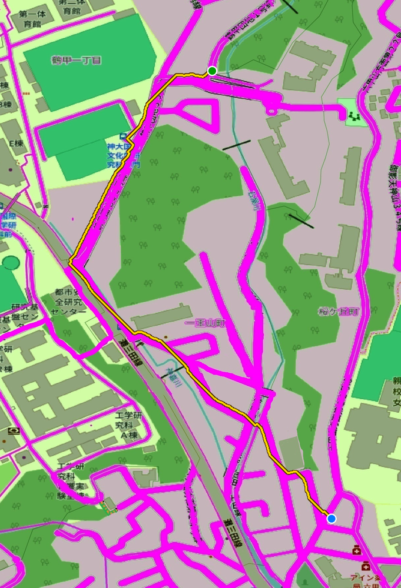

# Kouji_Itsu_Owaruno

[](https://github.com/E-arad/Kouji_Itsu_Owaruno/actions/workflows/ci.yml)
[](https://www.python.org/)
[](LICENSE)

**鶴甲１丁目・一王山町・桜丘町・寺口町に住む経済・経営・法実学部所属の神戸大学学生向けの学校までの最短距離（徒歩）を調べるデスクトップアプリです。**

令和８年６月９日（火）以降、本学キャンパス内（神戸市灘区六甲台町２−１−１）の学生会館（６階建て）において、屋根の一部が崩れ落ちる事故が発生しました。
鶴甲１丁目・一王山町・桜丘町・寺口町に住む経済・経営・法実学部所属の神戸大学の学生は、自分の学部までの学生会館を経由する近道が封鎖されることになりました。そこで、本アプリは、他の近道（学校までの）徒歩の場合の最短経路を教えてくれる機能を提供します。

実際、私自身が歩いて調べた歩ける道を表示しています。Google Map 等では反映されていない学生しか通れない道の問題点や、工事で実際は行けない道が表示されるなどの問題点が存在します。
そこで、自分がよく歩く範囲かつ上述の町周辺の地図に歩ける道をすべて描き込み、その地図を専用の入力として持たせました。徒歩専用で坂道などは気にせず、とにかく早く学校に歩いて行きたいという方に向いています。

また、学生の間ではあまり知らされていない山道なども含まれていますので、__必ず、天気を確認してからご利用ください。雨や雪の場合、絶対利用しないでください__

> **このアプリは同梱の地図専用です。** 他の地図には対応していません。細い道を1本ずつ描き込んであることが前提の設計で、その描き込みが無い地図では意味のある経路が出ません。地図の差し替え機能は意図的に設けていません。

## 使用例
必ず左上の天気のボタンをクリックし、今日の天気を確認してください。
雨・雪の際には絶対利用しないでください。

始点（青）と終点（緑）をクリックすると、道づたいの経路が黄色で描かれます。



同梱の地図（2768×2020 画素）で、クリックから表示まで少しの時間がかかります。

## インストール (Python や git が初めての方は「※」を見てください)

git がある場合はこちらでインストールできます。

```bash
pip install git+https://github.com/E-arad/Kouji_Itsu_Owaruno.git
```

Linux では tkinter が別パッケージのことがあります（`sudo apt install python3-tk`）。Windows と macOS の公式インストーラには同梱されています。

**以下のライブラリーよりも旧バージョンの方は [pipx](https://pipx.pypa.io/) も推奨です。**
>    "numpy>=1.24",
>    "pillow>=10.0",
>   "scipy>=1.10"

専用の環境を作って入れるため、既存のライブラリを一切書き換えません

```bash
pipx install git+https://github.com/E-arad/Kouji_Itsu_Owaruno.git
```
> ⚠️ pip で入れる場合、**numpy が 1.24 未満、pillow が 10.0 未満、scipy が 1.10 未満だと
> 自動で新しい版へ更新されます**。条件を満たしていれば手を触れませんが、
> 古い版に依存する別のコードをお持ちなら pipx か仮想環境をお使いください。

__※__
__プログラミングが初めての方へ__  — Python の導入から順を追った手順を [docs/はじめての方へ.md](docs/はじめての方へ.md) に用意しています。


## 使い方

```bash
kouji
```

1. 必ず最初に左上の「天気」で現在の天気をチェックし、歩ける日か否かを確認（[Open-Meteo](https://open-meteo.com/)、認証不要）
2. 地図上で始点をクリック
3. 神大周辺を終点としてクリック → 経路が表示されます
4. 「リセット」で引き直し。ホイールまたは拡大/縮小ボタンで倍率変更


道の真上を正確に押す必要はありません。近くの道へ自動的に吸着します。


## 開発

[uv](https://docs.astral.sh/uv/) を使います。

```bash
git clone https://github.com/E-arad/Kouji_Itsu_Owaruno.git
cd Kouji_Itsu_Owaruno
uv sync --all-groups     # 依存関係と開発ツールを入れる
uv run kouji             # 実行
```

### テスト・静的検査

```bash
uv run pytest            # 単体テスト
uv run ruff check .      # Lint
uv run ruff format .     # 整形
uv run mypy              # 型検査
```

CI では上記すべてを Python 3.10〜3.13 で実行しています。

### 構成

| モジュール | 役割 |
|---|---|
| `mask.py` | 画素の色から通行可能領域を判定し、探索グリッドを作る |
| `search.py` | 幅優先探索(BFS)による経路探索とクリック位置の吸着 |
| `weather.py` | Open-Meteo API から現在天気を取得 |
| `gui.py` | tkinter による画面 |

探索は**8近傍の幅優先探索(BFS)**です。グリッドが等間隔なので隣接セルへの移動コストがどこでも等しく、重み付きグラフ用の手法を使わずに最小手数の経路が得られます。`mask.py` と `search.py` は tkinter に依存しないため、画面を開かずに試験できます。

`benchmarks/benchmark.py` で縮小率と探索時間・経路品質の関係を測れます。

## 地図データについて

同梱の `src/Kouji_Itsu_Owaruno/data/map.png` は、e-Stat (政府統計の総合窓口) が公開しているオープンデータの地図をもとに、歩ける道を QGIS と Adobe Photoshop で編集を加えたものです。この画像は下記の MIT License の対象外で、元データの利用条件に従います。


## ライセンス

ソースコードは [MIT License](LICENSE) です。
